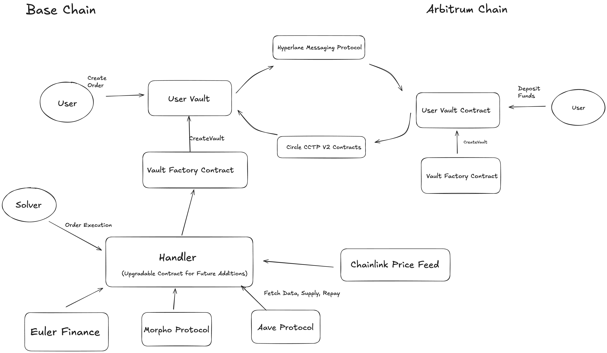

# Docs

## Concept
Creating a New form of limit orders that rely on Lending Protocols borrow position data to execute DeFi Actions such as Repaying Loan, Supplying  Collateral, Swapping Asset and more.

## Smart Contracts

Note: Vault are deployed for each address to hold funds till the condition for action becomes true and solver executes at a later stage.

## Architecture

### Overview of each contract

#### Vault Deployer

Vault Deployer deploys a new vault for User to execute operations and hold assets.

#### Vault

Each address deploys it's own vault on each chain they want to create orders and deposit assets. These vaults can be interconnected using Hyperlane Mailbox to request order cancellation, funds to be transferred using CCTP V2 Hooks(Under development).

The Vault stores condition params internally, and will be connected to Vault Factory for getting latest version of handler.

#### Vault Factory

The Contract maintains the registry of all the vaults and helps solver to index operations such as Order Creation, Asset Deposit, Order cancellation and Order Cancellation as well as maintain Cross-chain data for handler smart contract.

#### Handler

Handler is an upgradble smart contract which stores logic for evaluating conditions on Protocols such as Aave, Chainlink and Morpho. These conditions include

 - Chainlink Price Feeds for assets
 - Aave (Overall Portfolio, Collateral Information as per collateral token, Debt Information for each debt token, Supply Asset and Repay Integration Logic)
 - Morpho(Borrow parameters for position, V1.1 Earn vaults Integration)
 - Aerodrome (Integrated Router for executing Swaps )

Note:
In order to add more protocols such as Euler and chain based lending platforms, new version of Handler can be deployed and integrated into existing Vaults without any hassel to the users.

### Current Protocols Integrated on Mainnet
 - Chainlink (Arbitrum and Base )
 - Aave (Arbitrum and Base)
 - Hyperlane (Arbitrum and Base)
 - Morpho Borrow Positions (Base)
 - Morpho Vaults (V1.1 on Base for deposit and holding ERC-4646 tokens)

### Base

    - Vault Deployer - 0xbF7d635B1F6fed745d9414a414F1f8B372C0bd79
    - Vault Factory - 0xEc9A1021cC0d4619ac6405a648239bEB0bFCf76C
    - Handler - 0xdE8bb0fbcA6deE981c607C54f94bdd34A9D15362
    - Vault - 0x2554823F28f819a6D75081Ec65f7Be1798447eBD (Each address will have it's own vault to hold assets)

### Arbitrum

    - Vault Deployer - 0xEc9A1021cC0d4619ac6405a648239bEB0bFCf76C
    - Vault Factory - 0xdE8bb0fbcA6deE981c607C54f94bdd34A9D15362
    - Vault - 0x20c3d47D0551fcF44F906Cb04aEBB90ef4AA0BCA

[Repo Link](https://github.com/Shadow-Protector/Smart-Contracts)

## Indexer

Envio Indexer is being used to index smart contracts on Base Mainnet and will be required by solver to fetch ACTIVE_ORDERS and execute orders that fulfill the condition.

[Repo Link](https://github.com/Shadow-Protector/Indexer)

## Solver

A basic version of Solver is developed which can fetch active orders and check if the order's condition is true and can be executed on Base Mainnet.

[Repo Link](https://github.com/Shadow-Protector/Solver)
